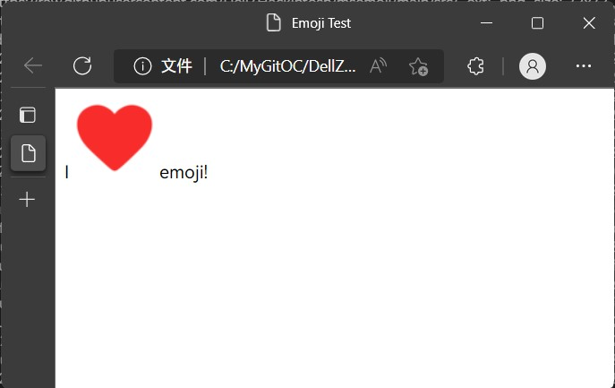

# Microsoft Emoji（msemoji)

[简体中文](./README.md) | **English**

‼️Statement: I don't make emoji,I just carry the emoji.Please use them fairly in accordance with Microsoft's terms, as detailed in the document ["How did you resolve copyright issues? / How can I use these emojis reasonably? "](#3how-did-you-resolve-copyright-issues--how-can-i-use-these-emojis-reasonably).

💬PS: Please understand that most of the content in this document uses machine translation, so it may not be properly expressed. You can help me translate it.

## ℹ️About msemoji

This is a repository for Microsoft-style emojis, and its scripts have been modified based on [Twemoji](https://github.com/twitter/twemoji) to make them compatible.

#### 🌟Highlight

Like Twemoji, this project can also replace the emoji on the web page with an image to get a uniform expression across all platforms. However, there is only one option that is too few, and this project allows you to get another option to decorate the web page with Microsoft emoticons to vividly express your mood.

## 🚀Quick Start

Include the following in your HTML <head></head> :

```
<script src="https://cdn.jsdelivr.net/gh/DellZHackintosh/msemoji@1.0.1/src/script/msemoji.min.js" crossorigin="anonymous"></script>
```

Then <body></body> add these in:

```
<script>
var div = document.createElement('div');
div.textContent = 'I \u2764\uFE0F emoji!';
document.body.appendChild(div);
msemoji.parse(document.body);
</script>
```

The result should be as follows:



It's that simple! The basic function of msemoji just is `msemoji.parse()`. It can convert emoji in two ways:

1. Transforms the emoji within the specified HTML element, such as 'document.body'. It will be converted automatically without additional action.

2. Outputs the input content that contains the emoji to the content with the converted emoji. It sounds complicated, but it's simple:
   
   ```
   msemoji.parse('I \u2764\uFE0F emoji!');      //Or: msemoji.parse('I ❤️ emoji!');
   
   /*
   Will be：
   I  emoji!
   （The address of picture is only a example）
   */
   ```
   
   Note, however, that this method does not automatically change the contents of an element as it did with the first method, it is just the output. If you want to use the output, you also need to use JavaScript to write the contents of its output into an element. In addition, this method is not as safe as the first method.

Congratulations! You already know its basic usage. However, we can't stop there. Look down to see what it's custom.

## 🆙Advanced Usage

### ⚙️Parameter settings

msemoji comes with some parameters that will give you more options. Here's an example.

```
msemoji.parse(document.body,{
    base: string,
    ext: string,
    className: string,
    folder: string
  });
```

Parameter explanation:

`base` refers to the location of the emoticon repository. For example, you can specify its location as: `https://example.com` ,or you can have subdirectorys: `https://example.org/msemoji`. Specifying the location of emoticon warehouses depends on where they are located. In general, you do not need to use this parameter, the script will use this repository by default unless you need to change a repository.

`ext` refers to the suffix name of the file. All emoji file name structures are "corresponding Unicode+suffix names". Alternative suffixes are `.png` and `.svg`, which will be covered later.

`className` works on CSS that controls emoji. They will be set to `emoji` by default. In general, you do not need to set this item unless you already have the same CSS Class class name on the page.

`folder` is associated with a file suffix name, which allows you to specify an emoticon in a different format. This parameter will be combined with the values you specify in `base` (including default values) to form the full directory, for example: `base` values are `https://example.org/msemoji` and `folder` values are `/png`, then the final link is `https://example.org/msemoji/png`. The default value is `72x72`. This value depends on the name of the folder. See below for what folders are available in this repository.

`high_contrast` is used to adapt to the new high contrast style. Use `true` (without quotes) to enable it. The default is `false`. **Note**: Only available in version 1.1.0 and later.

Note: What you see now is some of the parameters supported by the script, which are the most commonly used. If you want to know what extra parameters are available in the script, visit [Twemoji Documentation](https://github.com/twitter/twemoji#object-as-parameter).

### 🔢Introduction to the formats of emoji

This repository provides three emoji formats to choose from, and you can choose the right format for your website according to the actual situation.

| Variant style                    | 2D                                                                              | 3D                                                                                                                               | Flat                                                                        | Color                                                                                                                                                                                                                   | High Contrast                                                                                                                                                                                                                                                                                                |
|:--------------------------------:|:-------------------------------------------------------------------------------:|:--------------------------------------------------------------------------------------------------------------------------------:|:---------------------------------------------------------------------------:|:-----------------------------------------------------------------------------------------------------------------------------------------------------------------------------------------------------------------------:|:------------------------------------------------------------------------------------------------------------------------------------------------------------------------------------------------------------------------------------------------------------------------------------------------------------:|
| Example Appearance               |                                                          |                                                                                                           |                                                    |                                                                                                                                                                                               |                                                                                                                                                                                                                                                                          |
| The corresponding `ext` value    | `.png`                                                                          | `.png`                                                                                                                           | `.svg`                                                                      | `.svg`                                                                                                                                                                                                                  | `.svg`                                                                                                                                                                                                                                                                                                       |
| The corresponding `folder` value | `2D`                                                                            | `3D`                                                                                                                             | `Flat`                                                                      | `Color`                                                                                                                                                                                                                 | `High Contrast`                                                                                                                                                                                                                                                                                              |
| Features                         | The size is `72x72` pixels. Not scalable.                                       | The size is `256x256`, which is clearer, more three-dimensional and lively than `2D` Scalable. Same style as `2D`, smaller size. | Scalable. Same style as `2D`, small size.                                   | Scalable. Same style as `3D`.                                                                                                                                                                                           | Scalable. Suitable for people with disabilities or those who want to display emoji in black and white font.                                                                                                                                                                                                  |
| Pros                             | Good compatibility, low performance consumption, fast loading.                  | Good compatibility, less performance consumption, larger resolution, less blurry.                                                | Be clear in any situation. Fast loading.                                    | Be clear in any situation.                                                                                                                                                                                              | Actively small size. Make it easier for people with disabilities to read.                                                                                                                                                                                                                                    |
| Cons                             | Not scalable. Blurry on high-resolution screens or when viewed at larger sizes. | Not scalable. May be blurry when viewed in high resolution screens or at larger sizes. Larger than `2D` may slow down loading.   | Slightly weaker compatibility. Heavy usage may slightly affect performance. | Limited by special bitmap rasterization, it may be problematic to display or scale on some devices, and is not as detailed as `3D` style. Larger than `Flat` may slow down loading. Heavy usage can affect performance. | The currently provided `high_contrast` parameter implements a slight issue with the functionality that emoji for some skin tone variants does not display correctly (Twemoji's weird transcoding logic...), and there is no good solution yet. Avoid using emoji with a non-default skin tone in this style. |

### ✨Adjust the display of Emoji

Let's review the Quick Start now.


That‘s so big, clearly not what we want. So how should it be adjusted? We need the help with `CSS`!

#### 🥇Scheme 1 \(From Twitter\)

```
img.emoji {
   height: 1em;
   width: 1em;
   margin: 0 .05em 0 .1em;
   vertical-align: -0.1em;
}
```

Describe:

> This will make sure emoji derive their width and height from the `font-size` of the text they're shown with. It also adds just a little bit of space before and after each emoji, and pulls them upwards a little bit for better optical alignment.

Advantage: Aligning with text does not interrupt the coherence of reading, making them look like native fonts.

#### 🥈Scheme 2 \(From Flarum\)

```
img.emoji {
    height: 1.5em;
    margin: 0 .1em;
    vertical-align: -.3em;
}
```

Describe: 

> Each emoji will be slightly taller than the text in the same row, and will also add a little space before and after each emoji.

Advantage: Using emojis is usually to express your mood, such a setting makes the emoji slightly prominent, just right to increase the user's attention to it. In addition, making the emoji a little higher also makes the details more obvious, optimizing the reading experience on low-resolution screens.

#### 🥉Scheme 3 \(From Baidu Tieba\)

```
img.emoji {
    width: 30px;
}
```

Advantage: Want your emoji to stand out the most? Use this setting to make people notice them at a glance. We also recommend using them in 3D Emoji to highlight their stereoscopic and animated effects.

### 💎Special circumstances

If you are using a web system like Flarum, Emoji may be embedded in the system as a plug-in (for example, Flarum makes Twemoji a core plug-in and adds it to the system). In this case, there is no need to change the plugin, you can use the way to dynamically modify the image link in change for msemoji.

Here are some ideas although you can do in other ways.

1. Use built-in `sub_filter` function of Nginx.

2. Use JavaScript.

## 🤔FAQ

#### Why can't some emojis be displayed?

Microsoft does not update emojis very quickly each year, and new emojis are generally added with major version updates. When this happens, you can only wait for the update.

(Note: Want to see if your favorite emojis are from Microsoft? You can check it out [here](https://dellzhackintosh.github.io/emojitest.html).)

#### 2.Why are there no national and regional flags?

There are two reasons for this:

1. Microsoft doesn't plan to add them, so I needn't to add them.

2. For political reasons. If a country updates its flag, it is not updated here in time, which will cause unnecessary trouble.

Please understand that these emojis will be displayed in the style of the platform you are using. If you think it is necessary to add national flags, you can search for and add them yourself.

#### 3.How did you resolve copyright issues? / How can I use these emojis reasonably?

Microsoft has opened source Fluent emoji. Just follow its guidelines. Please visit the link below to learn more.

https://github.com/microsoft/fluentui-emoji

In addition, the script of msemoji is modified from twemoji, and its license is MIT license, inherits from twemoji.

#### 4.I don't like the style! Can you add some other styles of Emoji?

No, the reason is that it takes a lot of effort. Also, as with the project name, this project was born for Microsoft Fluent Emoji. If you want, you can consider forks and modify them yourself.

#### 5.How to handle bugs I encounter?

Anyone is welcome to report a problem via issue! When giving feedback, please describe in detail which file has the problem, what the format is, what problem is encountered, and how to fix it. If you can, you are also welcome to make Pull requests.

**Note:** Please check if your question has already been mentioned before.

## ❤Thanks for

Microsoft, designed the Emoji sets.;

Twitter, Provided the Twemoji and can be modified and customized.

## 📝Task list

- [x] 1.Add SVG format.

- [x] 2.Modify the msemoji script by the Twemoji script.

- [ ] 3.Updated at least once a year.
